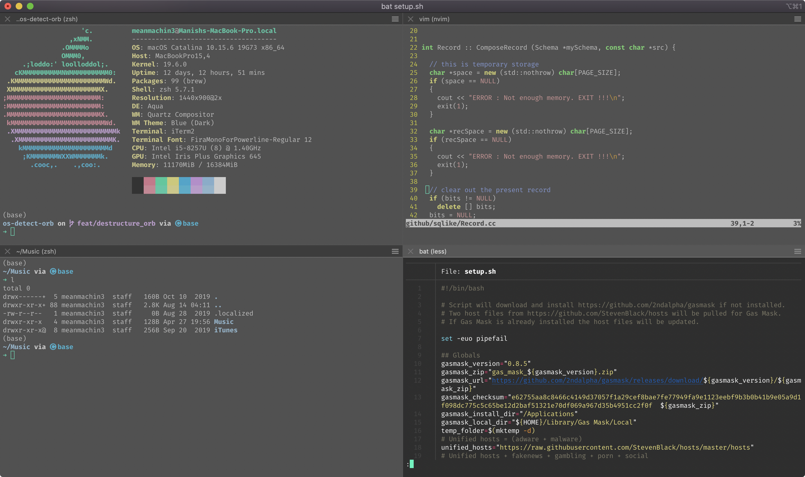

# Manish Yadav's Dotfiles



**Warning:** If you want to give these dotfiles a try, you should first fork this repository, review the code, and remove things you don’t want or need. Don’t blindly use my settings unless you know what that entails. Use at your own risk!

You could close this repository wherever you want and run the following command

```bash
git clone https://github.com/meanmachin3/dot-files.git && cd dot-files

```

Give executable permission to the script

```bash
chmod +x setup.sh
```

To install, run the following command

```bash
./setup.sh
```